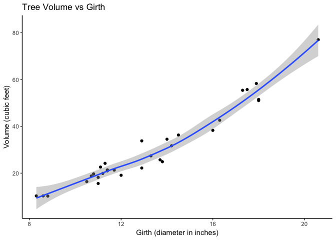

# Homework 06: Data wrangling wrap up

Welcome to my 6th homework assignment.
In this assignment I will complete two tasks of six available.
We are building on the data wrangling skills we learnt in STAT 545. In this assignment we *move on* from **plyr** and introduce tools such as **purrr**. I will also be wrangling the heck out of some **strings**.

I chose to do tasks #1 and #2. 

# Task #1 - Character data

## For this task I am re-working some of the exercises from [this](https://github.com/STAT545-UBC-students/hw06-katiezinn/blob/master/HW_06_KZ.mdhttps://r4ds.had.co.nz/strings.html) strings worksheet from the *R for Data Science* webpage.

Before I start I want to mention something that I found while trying to determine which dataset I wanted to use for this assignment. When you type the function **data()** you get a list of all the pre-loaded data in R. I think this will be quite useful for me in future assignments.

Anyway, here we go! I will be using the **stringr** package because it is the most applicable built in dataset for working with strings (has functions and data.


```r
#loading packages required for this task
library(tidyverse)
```

```
## ── Attaching packages ───────────────── tidyverse 1.2.1 ──
```

```
## ✔ ggplot2 3.0.0     ✔ purrr   0.2.5
## ✔ tibble  1.4.2     ✔ dplyr   0.7.6
## ✔ tidyr   0.8.1     ✔ stringr 1.3.1
## ✔ readr   1.1.1     ✔ forcats 0.3.0
```

```
## ── Conflicts ──────────────────── tidyverse_conflicts() ──
## ✖ dplyr::filter() masks stats::filter()
## ✖ dplyr::lag()    masks stats::lag()
```

Now I am going to make a string 


```r
My_String <- "A dog went for a walk in the park"

#tesing out my string
My_String
```

```
## [1] "A dog went for a walk in the park"
```

The **stringr** functions all start with *str_*. If you type out *str_* R should automatically give you some options for functions in a list. I will give some examples below.

Here is an example of a function you can use to analyze your string


```r
#tells you the number of characters in a string
str_length(My_String)
```

```
## [1] 33
```

Now we are going to explore using more than one string. I will create another string and see what we can do when we have 2 strings that we want to work with.


```r
My_String2 <- "A cat sat on the couch in the house"

#These are the 2 strings I will use

My_String
```

```
## [1] "A dog went for a walk in the park"
```

```r
My_String2
```

```
## [1] "A cat sat on the couch in the house"
```

Now we will combine these strings and see what we get.


```r
str_c(My_String, My_String2)
```

```
## [1] "A dog went for a walk in the parkA cat sat on the couch in the house"
```

It looks like the function simply stuck the two strings together. Now we will add some arguments to make our new string more readable.


```r
#adding sep to determine how the strings are separated
str_c(My_String, My_String2, sep = ", and ")
```

```
## [1] "A dog went for a walk in the park, and A cat sat on the couch in the house"
```

Nice! Now we have a sentence that has some better structue. Now I am going to make the "A" before cat a lowercase letter. 


```r
#making the string lowercase
Lower_My_String2 <- str_to_lower(My_String2)

str_c(My_String, Lower_My_String2, sep = ", and ")
```

```
## [1] "A dog went for a walk in the park, and a cat sat on the couch in the house"
```

Now we are going to play with more than 2 strings. The strings I am going to use are going to have multiple options for each part. 


```r
#making vectors of lists
name <- c("Amy", "Adam", "Angus", "Anton")

pet <- c("dinosaur", "dragon", "unicorn", "dog")

day <- c("today", "tomorrow")

#combining to form strings
str_c(
  "Hello ", name, ", I really like your pet ", pet,
  ". I hope I can meet it ", day, "."
)
```

```
## [1] "Hello Amy, I really like your pet dinosaur. I hope I can meet it today."  
## [2] "Hello Adam, I really like your pet dragon. I hope I can meet it tomorrow."
## [3] "Hello Angus, I really like your pet unicorn. I hope I can meet it today." 
## [4] "Hello Anton, I really like your pet dog. I hope I can meet it tomorrow."
```

Looking at the output from above, we can see how R handles the strings. **name** and **pet** both have 4 objects while **day** has 2. **Stringr** matches the first object of each string together, and if there isn't an even amount of objects in each string it will cycle through the string with less objects in it, notice how "today" and "tomorrow" are used twice in the output. 

The next thing I will practice is matching. using the *str_view* function we can search for certain patterns in a string. Once again... tryng to use some ~interesting~ lists as generated by the people around me to keep my reader engaged. 


```r
# I will create a new string for this exercise
RANDO_ANIMALS <- c("orca", "panther", "cougar", "cuddlefish", "anglerfish", "husky", "steelhead")
```

*"What is a peacock spider"*, you may ask. Click [here](https://www.youtube.com/watch?v=d_yYC5r8xMI) to take a break from grading my assignment and see something COOL. 


BACK TO WORK. Say we are interested in seeing which characters have letters **ae** in them. Let's use the **str_view** function.


```r
#looking for characters with letter *a*
str_view(RANDO_ANIMALS, "a")
```

<!--html_preserve--><div id="htmlwidget-8e8ea182ef4635686c80" style="width:960px;height:100%;" class="str_view html-widget"></div>
<script type="application/json" data-for="htmlwidget-8e8ea182ef4635686c80">{"x":{"html":"<ul>\n  <li>orc<span class='match'>a<\/span><\/li>\n  <li>p<span class='match'>a<\/span>nther<\/li>\n  <li>coug<span class='match'>a<\/span>r<\/li>\n  <li>cuddlefish<\/li>\n  <li><span class='match'>a<\/span>nglerfish<\/li>\n  <li>husky<\/li>\n  <li>steelhe<span class='match'>a<\/span>d<\/li>\n<\/ul>"},"evals":[],"jsHooks":[]}</script><!--/html_preserve-->

```r
#looking for characters with *an*
str_view(RANDO_ANIMALS, "an")
```

<!--html_preserve--><div id="htmlwidget-8a6fd6715c7006b88622" style="width:960px;height:100%;" class="str_view html-widget"></div>
<script type="application/json" data-for="htmlwidget-8a6fd6715c7006b88622">{"x":{"html":"<ul>\n  <li>orca<\/li>\n  <li>p<span class='match'>an<\/span>ther<\/li>\n  <li>cougar<\/li>\n  <li>cuddlefish<\/li>\n  <li><span class='match'>an<\/span>glerfish<\/li>\n  <li>husky<\/li>\n  <li>steelhead<\/li>\n<\/ul>"},"evals":[],"jsHooks":[]}</script><!--/html_preserve-->

```r
#looking for characters with *o* and one letter on either side
str_view(RANDO_ANIMALS, ".o.")
```

<!--html_preserve--><div id="htmlwidget-66e9d8487367ea4b936a" style="width:960px;height:100%;" class="str_view html-widget"></div>
<script type="application/json" data-for="htmlwidget-66e9d8487367ea4b936a">{"x":{"html":"<ul>\n  <li>orca<\/li>\n  <li>panther<\/li>\n  <li><span class='match'>cou<\/span>gar<\/li>\n  <li>cuddlefish<\/li>\n  <li>anglerfish<\/li>\n  <li>husky<\/li>\n  <li>steelhead<\/li>\n<\/ul>"},"evals":[],"jsHooks":[]}</script><!--/html_preserve-->

```r
#looking for an *a* at the beginning of a string
str_view(RANDO_ANIMALS, "^a")
```

<!--html_preserve--><div id="htmlwidget-ace9aaab42dbbe41f0b1" style="width:960px;height:100%;" class="str_view html-widget"></div>
<script type="application/json" data-for="htmlwidget-ace9aaab42dbbe41f0b1">{"x":{"html":"<ul>\n  <li>orca<\/li>\n  <li>panther<\/li>\n  <li>cougar<\/li>\n  <li>cuddlefish<\/li>\n  <li><span class='match'>a<\/span>nglerfish<\/li>\n  <li>husky<\/li>\n  <li>steelhead<\/li>\n<\/ul>"},"evals":[],"jsHooks":[]}</script><!--/html_preserve-->

```r
#looking for an *a* at the end of a string
str_view(RANDO_ANIMALS, "a$")
```

<!--html_preserve--><div id="htmlwidget-5f7f03dbb2758429de5a" style="width:960px;height:100%;" class="str_view html-widget"></div>
<script type="application/json" data-for="htmlwidget-5f7f03dbb2758429de5a">{"x":{"html":"<ul>\n  <li>orc<span class='match'>a<\/span><\/li>\n  <li>panther<\/li>\n  <li>cougar<\/li>\n  <li>cuddlefish<\/li>\n  <li>anglerfish<\/li>\n  <li>husky<\/li>\n  <li>steelhead<\/li>\n<\/ul>"},"evals":[],"jsHooks":[]}</script><!--/html_preserve-->

```r
#how many words start with a vowel?
str_view(RANDO_ANIMALS, "^[aeiou]")
```

<!--html_preserve--><div id="htmlwidget-7f2d7f53fc6bda26792c" style="width:960px;height:100%;" class="str_view html-widget"></div>
<script type="application/json" data-for="htmlwidget-7f2d7f53fc6bda26792c">{"x":{"html":"<ul>\n  <li><span class='match'>o<\/span>rca<\/li>\n  <li>panther<\/li>\n  <li>cougar<\/li>\n  <li>cuddlefish<\/li>\n  <li><span class='match'>a<\/span>nglerfish<\/li>\n  <li>husky<\/li>\n  <li>steelhead<\/li>\n<\/ul>"},"evals":[],"jsHooks":[]}</script><!--/html_preserve-->

```r
#how many words end with only consonants?
str_view(RANDO_ANIMALS, "[^aeiou]$")
```

<!--html_preserve--><div id="htmlwidget-8f08daf81ab1bac7d0a6" style="width:960px;height:100%;" class="str_view html-widget"></div>
<script type="application/json" data-for="htmlwidget-8f08daf81ab1bac7d0a6">{"x":{"html":"<ul>\n  <li>orca<\/li>\n  <li>panthe<span class='match'>r<\/span><\/li>\n  <li>couga<span class='match'>r<\/span><\/li>\n  <li>cuddlefis<span class='match'>h<\/span><\/li>\n  <li>anglerfis<span class='match'>h<\/span><\/li>\n  <li>husk<span class='match'>y<\/span><\/li>\n  <li>steelhea<span class='match'>d<\/span><\/li>\n<\/ul>"},"evals":[],"jsHooks":[]}</script><!--/html_preserve-->

```r
#how many words end with *ar* or *er*?
str_view(RANDO_ANIMALS, "(ar|er)$")
```

<!--html_preserve--><div id="htmlwidget-58901c0b4a58de949ca9" style="width:960px;height:100%;" class="str_view html-widget"></div>
<script type="application/json" data-for="htmlwidget-58901c0b4a58de949ca9">{"x":{"html":"<ul>\n  <li>orca<\/li>\n  <li>panth<span class='match'>er<\/span><\/li>\n  <li>coug<span class='match'>ar<\/span><\/li>\n  <li>cuddlefish<\/li>\n  <li>anglerfish<\/li>\n  <li>husky<\/li>\n  <li>steelhead<\/li>\n<\/ul>"},"evals":[],"jsHooks":[]}</script><!--/html_preserve-->
What if we want to look for somethig that isn't a letter?


```r
#creating my string
Alternative_String <- c("xyz", "x.y", "x%y", "y z", "z[#]x")

#viewing the character with any letter, a period, then a y
str_view(Alternative_String, ".[.]y")
```

<!--html_preserve--><div id="htmlwidget-0c4c147c209867cc3813" style="width:960px;height:100%;" class="str_view html-widget"></div>
<script type="application/json" data-for="htmlwidget-0c4c147c209867cc3813">{"x":{"html":"<ul>\n  <li>xyz<\/li>\n  <li><span class='match'>x.y<\/span><\/li>\n  <li>x%y<\/li>\n  <li>y z<\/li>\n  <li>z[#]x<\/li>\n<\/ul>"},"evals":[],"jsHooks":[]}</script><!--/html_preserve-->

```r
#viewing the character with an x, %, then any letter 
str_view(Alternative_String, "x[%].")
```

<!--html_preserve--><div id="htmlwidget-156020cc39fa95d2ba4c" style="width:960px;height:100%;" class="str_view html-widget"></div>
<script type="application/json" data-for="htmlwidget-156020cc39fa95d2ba4c">{"x":{"html":"<ul>\n  <li>xyz<\/li>\n  <li>x.y<\/li>\n  <li><span class='match'>x%y<\/span><\/li>\n  <li>y z<\/li>\n  <li>z[#]x<\/li>\n<\/ul>"},"evals":[],"jsHooks":[]}</script><!--/html_preserve-->

```r
#viewing the character with any letter, #, and any letter
str_view(Alternative_String, ".[#].")
```

<!--html_preserve--><div id="htmlwidget-ba3c9b11b4738afabfca" style="width:960px;height:100%;" class="str_view html-widget"></div>
<script type="application/json" data-for="htmlwidget-ba3c9b11b4738afabfca">{"x":{"html":"<ul>\n  <li>xyz<\/li>\n  <li>x.y<\/li>\n  <li>x%y<\/li>\n  <li>y z<\/li>\n  <li>z<span class='match'>[#]<\/span>x<\/li>\n<\/ul>"},"evals":[],"jsHooks":[]}</script><!--/html_preserve-->

```r
#viewing the character with a space between any two letters
str_view(Alternative_String, ".[ ].")
```

<!--html_preserve--><div id="htmlwidget-06dd20abae34a4feecb3" style="width:960px;height:100%;" class="str_view html-widget"></div>
<script type="application/json" data-for="htmlwidget-06dd20abae34a4feecb3">{"x":{"html":"<ul>\n  <li>xyz<\/li>\n  <li>x.y<\/li>\n  <li>x%y<\/li>\n  <li><span class='match'>y z<\/span><\/li>\n  <li>z[#]x<\/li>\n<\/ul>"},"evals":[],"jsHooks":[]}</script><!--/html_preserve-->

Now, we we will apply some of the skills we have learnt in more of an applicable way to real life. We will be using **str_detect()** to see if a character vector matches a pattern.


```r
#How many a's are there in the RANDO_ANIMALS vector?
sum(str_detect(RANDO_ANIMALS, "a"))
```

```
## [1] 5
```

```r
#How many characters in the RANDO_ANIMALS vector START with a?
sum(str_detect(RANDO_ANIMALS, "^a"))
```

```
## [1] 1
```

```r
#what proportion of the words in RANDO_ANIMALS have an *a* in them?
mean(str_detect(RANDO_ANIMALS, "a"))
```

```
## [1] 0.7142857
```

Now I am going to work with the **words** vector to increase my diversity of words to work with.


```r
#get a glimpse of the vector
head(words)
```

```
## [1] "a"        "able"     "about"    "absolute" "accept"   "account"
```

Let's figure out which words in the **words** vector start with a **y**


```r
words[str_detect(words, "^y")]
```

```
## [1] "year"      "yes"       "yesterday" "yet"       "you"       "young"
```

Now,let's make things a little more complicated and work with some senteces. 
We will be using the **sentences** dataset found in the **stringr** package (in the tidyverse)


```r
#checking it out
head(sentences)
```

```
## [1] "The birch canoe slid on the smooth planks." 
## [2] "Glue the sheet to the dark blue background."
## [3] "It's easy to tell the depth of a well."     
## [4] "These days a chicken leg is a rare dish."   
## [5] "Rice is often served in round bowls."       
## [6] "The juice of lemons makes fine punch."
```

What if we want to see which sentences have FISH of our choosing in it?


```r
#create a vector
fish <- c("fish", "trout", "salmon")

#turn it into a single regular expression
fish_match <- str_c(fish, collapse = "|")

#check it out
fish_match
```

```
## [1] "fish|trout|salmon"
```

```r
#checking which sentences have these animals 
has_fish <- str_subset(sentences, fish_match)

#check it out
has_fish
```

```
## [1] "A rod is used to catch pink salmon."          
## [2] "The fish twisted and turned on the bent hook."
## [3] "Two blue fish swam in the tank."              
## [4] "The lure is used to catch trout and flounder."
## [5] "Whitings are small fish caught in nets."
```
We found a way to sift through all of the sentences and pull out the ones with key words of our choosing, very neat.

Cool! Now that we have learnt a lot and have gotten comfy working with strings let's move on to creating a function! 

# Tast #2 - Writing functions

## This is the 2nd part of my assignment. For this task I will be creating a function.

First, I will make a functino that does something useful to the **trees** dataset. 

Working with the **trees** dataset wasn't as exciting as anticipated so I also create a function that is useful for my thesis. I calculate the instantaneous growth rate for fish using a function. And somehow... I actually pulled it off. 


```r
head(trees)
```

```
##   Girth Height Volume
## 1   8.3     70   10.3
## 2   8.6     65   10.3
## 3   8.8     63   10.2
## 4  10.5     72   16.4
## 5  10.7     81   18.8
## 6  10.8     83   19.7
```

This dataset provies the girth (diameter at DBH (diameter at breast height), which is 4 ft 6 in from the base of the tree), height, and volume of 31 black cherry trees. 

Let's create a function to determine if girth at DBH can help us determine the volume of a tree. 


```r
#downloading packages I may use for this task
library(tidyverse)
```

First, let's plot the data to see what we are working with. It is always a good idea to visualize the data before making any manipulations


```r
ggplot(trees, aes(Girth, Volume)) + 
  geom_point() +
    geom_smooth(method=loess) +
      theme_classic() +
        ggtitle("Tree Volume vs Girth") +
          xlab("Girth (diameter in inches)") +
            ylab("Volume (cubic feet)")
```

<!-- -->

Now I am going to create the linear function that predicts volume from girth.


```r
#fitting my function (single factor ANOVA)
trees_lm <- lm(Volume ~ Girth, data = trees)

#let's check out a summary of my function (ignore these p-values)
summary(trees_lm)
```

```
## 
## Call:
## lm(formula = Volume ~ Girth, data = trees)
## 
## Residuals:
##    Min     1Q Median     3Q    Max 
## -8.065 -3.107  0.152  3.495  9.587 
## 
## Coefficients:
##             Estimate Std. Error t value Pr(>|t|)    
## (Intercept) -36.9435     3.3651  -10.98 7.62e-12 ***
## Girth         5.0659     0.2474   20.48  < 2e-16 ***
## ---
## Signif. codes:  0 '***' 0.001 '**' 0.01 '*' 0.05 '.' 0.1 ' ' 1
## 
## Residual standard error: 4.252 on 29 degrees of freedom
## Multiple R-squared:  0.9353,	Adjusted R-squared:  0.9331 
## F-statistic: 419.4 on 1 and 29 DF,  p-value: < 2.2e-16
```

```r
# I am going to use the anova() function to test my hypotheses that volume is predicted by girth.
anova(trees_lm)
```

```
## Analysis of Variance Table
## 
## Response: Volume
##           Df Sum Sq Mean Sq F value    Pr(>F)    
## Girth      1 7581.8  7581.8  419.36 < 2.2e-16 ***
## Residuals 29  524.3    18.1                      
## ---
## Signif. codes:  0 '***' 0.001 '**' 0.01 '*' 0.05 '.' 0.1 ' ' 1
```

I realize that this wasn't part of the assignment but how can you fit a linear model and not check it's significance!? The P value is less than 0.05... IT IS SIGNIFICANT! 

Now we are going to turn this code into a function.


```r
#creating my function
trees_function <- function(Volume, Girth) {
  trees_lm <- lm(Volume ~ Girth, data = trees)
  setNames(coef(trees_lm), c("intercept", "slope"))
}

#testing the function
trees_function(trees)
```

```
##  intercept      slope 
## -36.943459   5.065856
```
Maybe we want to do more than work with simple trees measurements. Let's explore a dataset with more variables, how about something from my research. One thing I have to do with my research is calculate the instantaneous growth of fish in my experiment. It is calculated in the following way:

instantaneous growth = ( ( LN(finial length) - LN(initial length) ) / # days of growth ) * 100

Now I am going to make a data frame that we can work with.


```r
#final length
fn_ln <- c(145.5, 147, 132, 127, 150.5, 153.5, 131.5, 148.5, 152.5, 128)

#initial length
in_ln <- c(137, 135, 120, 118, 140, 116, 131, 137, 144, 119)

#number of days since last capture
days <- c(30, 30, 30, 30, 33, 33, 33, 33, 33, 47)

Fish_data <- data.frame(fn_ln = fn_ln, in_ln = in_ln, days = days, stringsAsFactors = FALSE)

Fish_data$fn_ln <- as.numeric(Fish_data$fn_ln)
Fish_data$in_ln <- as.numeric(Fish_data$in_ln)
Fish_data$days <- as.numeric(Fish_data$days)
```

I am going to attempt to have multiple inputs and outputs... let's see if I can pull this off. 


```r
#creating my function
instantaneous_growth <- function(f, i, d) {
  #calculating that I want my function to accomplish
 growth <- ((log(f) - log(i)) / d)*100
return(list(growth = growth))
}

#testing my function
instantaneous_growth(Fish_data$fn_ln, Fish_data$in_ln, Fish_data$days)
```

```
## $growth
##  [1] 0.20065054 0.28385936 0.31770060 0.24500821 0.21915352 0.84881932
##  [7] 0.01154403 0.24425464 0.17379181 0.15512079
```

```r
#putting the rates into a vector
growth <- instantaneous_growth(Fish_data$fn_ln, Fish_data$in_ln, Fish_data$days)

#adding the vector to a new data frame
Fish_data_with_rates <- data.frame(fn_ln = fn_ln, in_ln = in_ln, days = days, growth = growth, stringsAsFactors = FALSE)

#when plotting I was getting an error, so I am making sure that Mydata_growth_rates is NUMERIC
growth <- as.numeric(Fish_data_with_rates$instanteneous_growth_by_length)

#plotting my new found data against intiial weight 
ggplot(Fish_data_with_rates, aes(in_ln, growth)) +
  geom_point() +
    geom_smooth(method=loess) +
      theme_classic() +
        ggtitle("Instantaneous growth vs initial length") +
          xlab("Initial length (mm)") +
            ylab("Instantaneous growth (mm/day)")
```

<!-- -->


WOW IT ACTUALLY WORKED. That took me a lot longer than i'd like to admit. Working with 3 inputs was more difficult than I expected. I couldn't get this code to work for a long time as I didn't realize there needed to be a return function.

It feels pretty awesome to have created a function that can be used with my data that I have collected for my thesis. It took a long time to construct this function but I am glad I did it as I will actually be able to use it in the future :)

With this function I can now quickly zip in my data to get instantaneous growth for my fish. YAHOO.

It was also cool to test adding the data I calculated into a data frame with the other data that I initially had.


